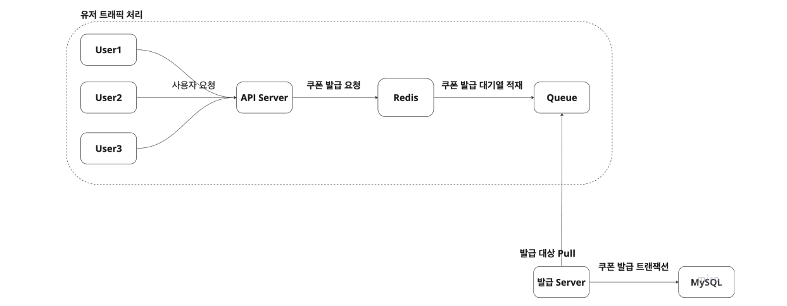
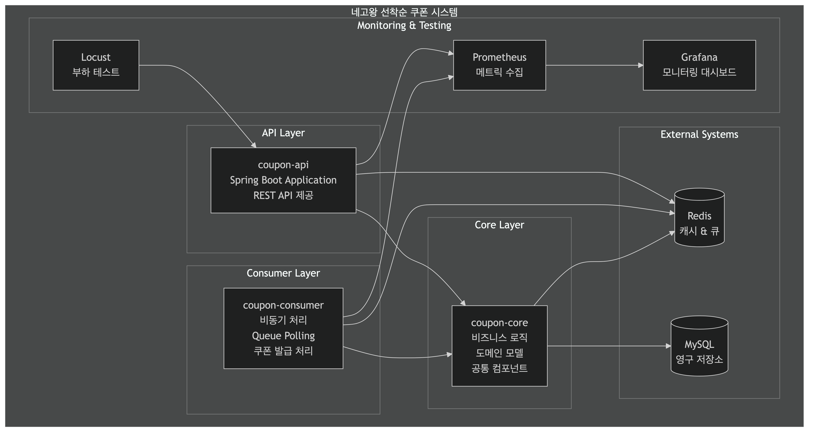
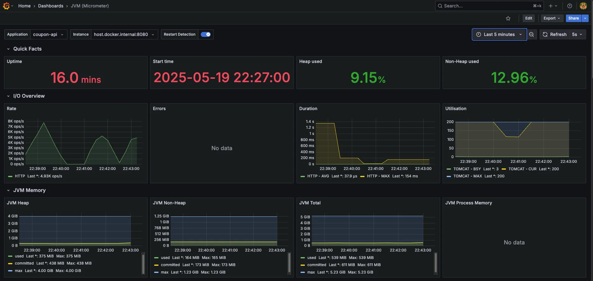

# 선착순 쿠폰 발급 시스템 - 버전별 성능 최적화

## 📋 프로젝트 개요

선착순 이벤트를 위한 쿠폰 발급 시스템으로, 대용량 트래픽 환경에서 안정적인 쿠폰 발급을 보장하는 시스템입니다.
동시성 제어와 성능 최적화를 통해 버전별로 시스템을 개선해나가는 과정을 보여줍니다.

## 🎯 주요 요구사항

- **이벤트 기간 내 발급**: 지정된 기간 내에만 쿠폰 발급 가능
- **1인 1회 제한**: 사용자당 1개의 쿠폰만 발급 가능
- **수량 제한**: 선착순으로 제한된 수량의 쿠폰만 발급
- **동시성 보장**: 대용량 트래픽에서도 정확한 수량 관리

## 🏗️ 시스템 아키텍처

### 전체 구조




### 비동기 쿠폰 발급 처리 구조

#### 모듈별 역할

1. **coupon-api (API 서버)**

   - 쿠폰 발급 요청을 받아 검증
   - Redis 큐에 발급 요청 적재
   - 클라이언트에게 즉시 응답 반환

2. **coupon-core (비즈니스 로직)**

   - 쿠폰 발급 비즈니스 로직 구현
   - 버전별 동시성 제어 전략 (V1~V3)
   - Redis 캐시 및 큐 관리
   - 쿠폰 발급 검증 로직

3. **coupon-consumer (비동기 처리)**
   - Redis 큐에서 발급 요청을 폴링하여 처리
   - 실제 쿠폰 발급 및 MySQL 저장
   - 스케줄링 기반 실시간 처리 (1초 간격)

#### 데이터 흐름

1. **요청 단계**: API 서버가 쿠폰 발급 요청을 받아 core 모듈의 검증 로직 실행
2. **큐 적재**: 검증 통과 시 Redis 큐에 발급 요청 적재
3. **비동기 처리**: Consumer가 1초마다 큐를 폴링하여 요청을 꺼내 실제 쿠폰 발급 처리
4. **영구 저장**: MySQL에 최종 쿠폰 발급 결과 저장

#### 인프라 구성

- **Redis**: 발급 요청 큐와 발급 이력 관리, 캐시 저장소
- **MySQL**: 최종 쿠폰 발급 결과 영구 저장
- **Monitoring**: Prometheus + Grafana를 통한 실시간 모니터링

## 🔄 버전별 시스템 개선 과정

### 버전별 개선 사항 요약

| Version | 특징                                                                | 개선 사항     |
| ------- | ------------------------------------------------------------------- | ------------- |
| V0      | MySQL 기반 쿠폰 발급 시스템 - 동기 처리                             | 기본 구현     |
| V1      | Redis (Cache, Queue, Redisson) 도입으로 성능 개선 - 비동기 + 분산락 | 병목 해결     |
| V2      | Redis Lua Script로 동시성 제어 및 성능 개선                         | 동시성 최적화 |
| V3      | Local Cache (Caffeine)로 성능 개선                                  | 캐시 최적화   |

### V0: MySQL 기반 동기 처리 시스템

**핵심 특징:**

- MySQL 데이터베이스 기반 쿠폰 발급
- 동기식 처리로 인한 성능 제약
- 단일 서버 환경에서의 기본적인 구현

**구현 방식:**

```java
// 기본적인 MySQL 기반 쿠폰 발급
@Transactional
public void issueCoupon(long couponId, long userId) {
    // 1. 쿠폰 정보 조회
    Coupon coupon = couponRepository.findById(couponId);

    // 2. 발급 가능 여부 검증
    if (coupon.getTotalQuantity() <= coupon.getIssuedQuantity()) {
        throw new CouponIssueException("발급 가능한 수량을 초과했습니다.");
    }

    // 3. 중복 발급 검증
    if (couponIssueRepository.existsByCouponIdAndUserId(couponId, userId)) {
        throw new CouponIssueException("이미 발급된 쿠폰입니다.");
    }

    // 4. 쿠폰 발급 처리
    CouponIssue couponIssue = new CouponIssue(couponId, userId);
    couponIssueRepository.save(couponIssue);

    // 5. 발급 수량 업데이트
    coupon.increaseIssuedQuantity();
    couponRepository.save(coupon);
}
```

**문제점:**

- 데이터베이스 락으로 인한 성능 저하
- 동시 요청 처리 시 병목 현상
- 확장성 제약

### V1: Redisson 분산 락 기반 동시성 제어

**핵심 특징:**

- Redisson 분산 락을 사용한 동시성 제어
- Redis Set을 통한 발급 수량 및 중복 검증
- Redis List를 통한 비동기 큐 처리

**구현 방식:**

```java
// 분산락을 사용한 동시성 제어
distributeLockExecutor.execute("lock_%s".formatted(couponId), 3000, 3000, () -> {
    couponIssueRedisService.checkCouponIssueQuantity(coupon, userId);
    issueRequest(couponId, userId);
});
```

**장점:**

- 안정적인 동시성 제어
- 명확한 락 메커니즘

**단점:**

- 락 경합으로 인한 성능 저하
- 네트워크 오버헤드 증가

### V2: Redis Script 기반 원자적 연산

**핵심 특징:**

- Redis Lua Script를 사용한 원자적 연산
- 분산 락 없이 동시성 보장
- 단일 네트워크 호출로 모든 검증 및 처리

**구현 방식:**

```lua
-- Redis Lua Script
if redis.call('SISMEMBER', KEYS[1], ARGV[1]) == 1 then
    return '2'  -- 중복 발급
end

if tonumber(ARGV[2]) > redis.call('SCARD', KEYS[1]) then
    redis.call('SADD', KEYS[1], ARGV[1])
    redis.call('RPUSH', KEYS[2], ARGV[3])
    return '1'  -- 발급 성공
end

return '3'  -- 수량 초과
```

**개선사항:**

- 락 경합 제거로 성능 향상
- 네트워크 호출 횟수 감소
- 원자적 연산으로 데이터 일관성 보장

### V3: Local Cache 추가로 성능 최적화

**핵심 특징:**

- Redis Cache + Local Cache 이중 캐싱
- 쿠폰 정보 조회 성능 대폭 향상
- Redis 부하 감소

**구현 방식:**

```java
// Local Cache 사용
@Cacheable(cacheNames = "coupon", cacheManager = "localCacheManager")
public CouponRedisEntity getCouponLocalCache(long couponId) {
    return proxy().getCouponCache(couponId);
}
```

**개선사항:**

- 쿠폰 정보 조회 시 네트워크 호출 제거
- Redis 서버 부하 감소
- 응답 시간 단축

## 📊 성능 비교

### 부하 테스트 결과

- **테스트 환경**: 1,000명씩 증가하여 최대 10,000명까지 테스트, 일정 RPS 달성 시 중단
- **서버 스펙**: t2.medium (2core, 4GB), MySQL db.t3.micro, Redis cache.t3.micro

| Version | RPS      | 특징                                                                |
| ------- | -------- | ------------------------------------------------------------------- |
| V0      | 2,321.4  | MySQL 기반 쿠폰 발급 시스템 - 동기 처리                             |
| V1      | 1,491.3  | Redis (Cache, Queue, Redisson) 도입으로 성능 개선 - 비동기 + 분산락 |
| V2      | 8,832.2  | Redis Script를 활용한 동시성 제어 - 비동기 + Redis Script           |
| V3      | 11,084.1 | Local Cache (Caffeine) 적용 - 비동기 + Redis Script + Local Cache   |

### 버전별 상세 특징

#### V0: MySQL 기반 동기 처리 (RPS: 2,321.4)

- **데이터베이스 레코드 락**을 사용한 동시성 제어
- **트랜잭션 내에서 모든 처리**를 수행
- 쿠폰 발급 요청을 **즉시 처리**

#### V1: Redis + Redisson 분산락 (RPS: 1,491.3)

- Redis를 사용한 **비동기 처리** 도입
- 쿠폰 발급 요청 / 쿠폰 발급 트랜잭션 분리
- **Redisson 분산 락**으로 동시성 제어
- 쿠폰 발급 요청을 큐에 저장
- **락 획득에 시간이 소요**되어 성능 저하

#### V2: Redis Script 활용 (RPS: 8,832.2)

- **Redis Script를 사용한 원자적 연산**
- 분산 락 없이 Redis의 원자성을 활용
- 쿠폰 발급 요청을 큐에 저장
- **V1보다 락 획득 오버헤드가 없어** 더 빠름

#### V3: Local Cache 적용 (RPS: 11,084.1)

- **Local Cache를 사용하여 Redis 조회 최소화**
- Redis Script를 사용한 원자적 연산
- 쿠폰 발급 요청을 큐에 저장
- **캐시 조회가 가장 빠르고 락 획득 오버헤드도 없음**

### 성능 개선 분석

- **V0 → V1**: 비동기 처리 도입했지만 분산락 오버헤드로 인해 성능 저하 (-35.8%)
- **V1 → V2**: Redis Script로 락 오버헤드 제거하여 대폭 성능 향상 (+492.1%)
- **V2 → V3**: Local Cache로 Redis 조회 최소화하여 추가 성능 향상 (+25.5%)
- **전체 개선**: V0 대비 V3에서 **377.3% 성능 향상** 달성

## 🛠️ 기술 스택

### Backend

- **Java 17** + **Spring Boot 3.1**
- **Spring Data JPA** + **QueryDSL**
- **Redis** (캐시 및 큐)
- **MySQL** (영구 저장)

### Infrastructure

- **AWS EC2** (서버)
- **AWS RDS** (MySQL)
- **AWS ElastiCache** (Redis)

### Monitoring & Testing

- **Prometheus** + **Grafana** (모니터링)
- **Locust** (부하 테스트)
- **Spring Actuator** (헬스체크)

### DevOps

- **Docker** + **Docker Compose**
- **Gradle** (빌드 도구)

## 🚀 실행 방법

### 1. 환경 설정

```bash
# Docker 컨테이너 실행
docker-compose up -d

# 애플리케이션 빌드
./gradlew build
```

### 2. 애플리케이션 실행

```bash
# API 서버 실행
./gradlew :coupon-api:bootRun

# Consumer 실행
./gradlew :coupon-consumer:bootRun
```

### 3. 부하 테스트 실행

```bash
# V1 테스트
cd load-test
locust -f locustfile-issue-asyncV1.py --host=http://localhost:8080

# V2 테스트
locust -f locustfile-issue-asyncV2.py --host=http://localhost:8080

# V3 테스트
locust -f locustfile-issue-asyncV3.py --host=http://localhost:8080
```

## 📈 모니터링



### 주요 메트릭

- **응답 시간**: p50, p90, p99
- **처리량**: RPS (Requests Per Second)
- **에러율**: 실패 요청 비율
- **Redis 메트릭**: 메모리 사용량, 명령어 실행 시간
- **MySQL 메트릭**: 연결 수, 쿼리 실행 시간

### 대시보드

- Grafana를 통한 실시간 모니터링
- Prometheus 메트릭 수집 및 알림

## 🔍 핵심 학습 포인트

### 1. 동시성 제어 방식 비교

- **분산 락**: 안정적이지만 성능 오버헤드
- **Redis Script**: 원자적 연산으로 성능과 안정성 모두 확보

### 2. 캐싱 전략

- **Redis Cache**: 분산 환경에서 일관성 보장
- **Local Cache**: 최고 성능, 단일 서버 환경

### 3. 비동기 처리

- **Redis Queue**: 안정적인 메시지 전달
- **Consumer Pattern**: 확장 가능한 처리 구조

### 4. 성능 최적화

- **네트워크 호출 최소화**: Redis Script 활용
- **캐시 계층화**: Local + Redis 이중 캐싱
- **부하 분산**: 마이크로서비스 아키텍처

## 📝 결론

이 프로젝트는 대용량 트래픽 환경에서의 선착순 쿠폰 발급 시스템을 단계적으로 최적화하는 과정을 보여줍니다.

**V1**에서는 안정성을 우선시한 분산 락 방식을 사용했고, **V2**에서는 Redis Script를 통해 성능을 개선했으며, **V3**에서는 Local Cache를 추가하여 최종적인 성능 최적화를 달성했습니다.

각 버전별 개선사항을 통해 동시성 제어, 캐싱 전략, 비동기 처리 등 실제 운영 환경에서 중요한 기술들을 학습할 수 있습니다.
